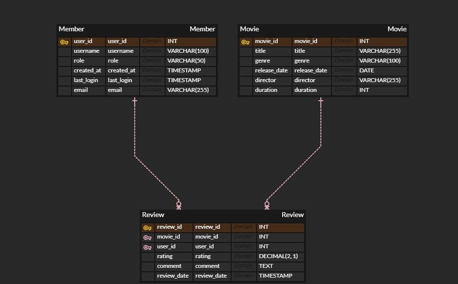

# 🍿CineTalks

**CineTalks**는 사용자가 본 영화를 기록하고, 영화에 대한 리뷰를 남길 수 있는 영화 리뷰 플랫폼입니다. 서비스는 사용자의 리뷰와 시청 기록을 분석하여 맞춤형 추천과 다양한 기능을 제공할 수 있습니다.

## 데이터베이스 구조

## 주요 기능

### 사용자 관리:

-   **사용자 등록**: 회원 가입 기능
-   **로그인/로그아웃**
-   **개인 정보 관리**: 사용자 정보 조회, 수정, 삭제

### 리뷰 시스템:

-   **리뷰 작성**: 영화에 대해 평점(0~5점)과 코멘트를 작성
-   **리뷰 수정 및 삭제**
-   **영화 별 리뷰 조회**

### 영화 관리:

-   **영화 리스트 조회**: 제목, 장르, 감독 등의 영화 목록을 전체 조회
-   **영화 정보 조회**: 개별 영화의 세부 정보 확인
-   **영화 정보 관리(관리자)**: 영화 정보 추가 및 수정

## 기술 스택

-   **Kotlin**
-   **Spring Boot**
