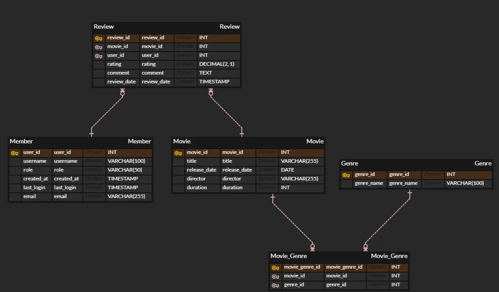

# 🍿CineTalks

**CineTalks**는 사용자가 시청한 영화에 대한 리뷰를 남길 수 있는 영화 리뷰 플랫폼입니다. 서비스는 사용자의 리뷰와 시청 기록을 분석하여 맞춤형 추천과 다양한 기능을 제공할 수 있습니다.

## 데이터베이스 구조

## 주요 기능

### 사용자 관리:

-   **사용자 등록**: 회원 가입 기능
-   **로그인/로그아웃**
-   **개인 정보 관리**: 사용자 정보 조회(특정 회원, 전체 회원), 수정, 삭제

### 리뷰 시스템:

-   **리뷰 작성**: 영화에 대해 평점(0~5점)과 코멘트를 작성
-   **리뷰 수정 및 삭제**
-   **영화 별 리뷰 조회**

### 영화:

-   **영화 리스트 조회**: 제목, 장르, 감독 등의 영화 목록을 전체 조회
-   **영화 정보 조회**: 개별 영화의 세부 정보 확인
-   **영화 정보 관리(관리자)**: 영화 정보 추가 및 수정

## REST API 설계

### 엔드포인트 설계

#### 1. 영화 (Movie)
- **GET /movies**: 모든 영화 조회
- **GET /movies/{movie_id}**: 특정 영화 조회
- **POST /movies**: 새로운 영화 추가
- **PUT /movies/{movie_id}**: 특정 영화 정보 수정
- **DELETE /movies/{movie_id}**: 특정 영화 삭제

#### 2. 장르 (Genre)
- **GET /genres**: 모든 장르 조회
- **GET /genres/{genre_id}**: 특정 장르 조회
- **POST /genres**: 새로운 장르 추가
- **DELETE /genres/{genre_id}**: 특정 장르 삭제

#### 3. 영화 장르 매핑 (Movie_Genre)
- **POST /movies/{movie_id}/genres**: 특정 영화에 장르 추가
- **DELETE /movies/{movie_id}/genres/{genre_id}**: 특정 영화에서 특정 장르 제거

#### 4. 회원 (Member)
- **GET /members**: 모든 회원 조회
- **GET /members/{user_id}**: 특정 회원 조회
- **POST /members**: 새로운 회원 추가
- **PUT /members/{user_id}**: 특정 회원 정보 수정
- **DELETE /members/{user_id}**: 특정 회원 삭제

#### 5. 리뷰 (Review)
- **POST /reviews**: 새로운 리뷰 작성
    - 요청 본문에 `movie_id`와 `user_id` 포함
- **PUT /reviews/{review_id}**: 특정 리뷰 수정
- **DELETE /reviews/{review_id}**: 특정 리뷰 삭제

## 기술 스택

-   **Kotlin**
-   **Spring Boot**
